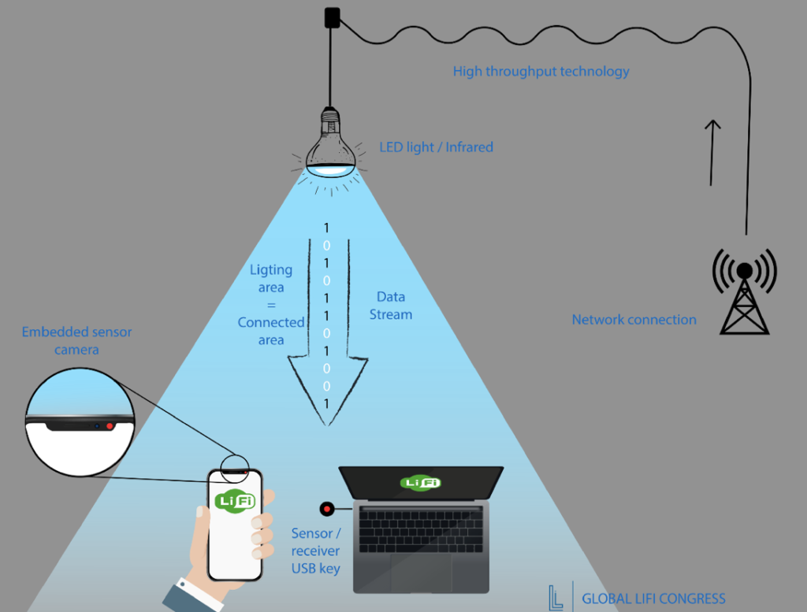

## LIFI (JARINGAN INTERNET NIRKABEL BERBASIS CAHAYA)
   Menurut saya lifi adalah kependekan dari Light Fidelity , Jaringan internet atau sistem transfer data sangat cepat nirkabel berbasis cahaya sedang dikembangkan para peneliti di Fraunhofer Heinrich Hertz, Jerman. LiFi atau Light Fidelity memiliki kegunaan seperti WiFi internet. Bedanya, jika WiFi menggunakan sinyal radio untuk mentransmisikan datanya, maka LiFi menggunakan cahaya dari bohlam lampu LED untuk mentransfer data. Dengan spektrum cahaya yang amat lebar, LiFi bisa meneruskan data dengan amat cepat.
   
   Li-Fi yang memiliki kecepatan data berkali-kali lipat dibandingkan dengan Wi-Fi ini disebabkan karena jenis LED yang merupakan semikonduktor punya sifat berbeda dari jenis lampu lain. Dengan sifat dan ciri-ciri seperti ini membuat LED mampu untuk beralih on dan off dalam beberapa nanodetik atau miliar detik. Nanodetik ini jika dikonversikan dalam kecepatan data setara dengan 1Gbits/s. Maka dari itu saat Wi-Fi hanya bisa mencapai 100 Mbits/s kecepatan data, maka ini artinya Li-Fi memiliki kecepatan 10 kali lebih cepat dari Wi-Fi  dengan kecepatan hingga 100 Gbps . secanggih cangihnya teknologi pasti akan memiliki kelebihan dan kekuranganya.

### Kelebihan LIFI
##### -lifi memiliki akses internet 10 kali lebih cepat dibandingkan wifi.
##### -lebih mudah karna tidak pakai kabel.
##### -tidak bisa di hack, karna memiliki gelombang cahaya yg cukup aman.

### Kekurangan LIFI
##### -hanya dapat digunakan diruangan yg memiliki akses cahaya langsung dari lampu led.
##### -tidak bisa menembus dinding layaknya WIFI.
##### -jika lampu led mati maka internet akan teerputus.
##### -belum rilis di semua negara termasuk indonesia.
##### -lumayan lebih mahal.
